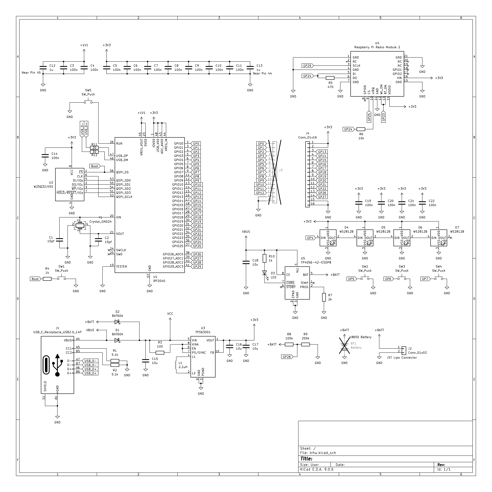
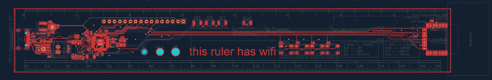
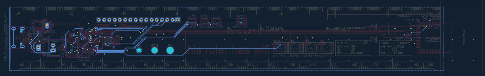
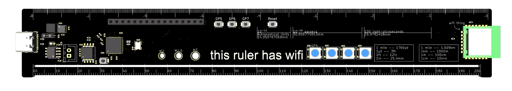
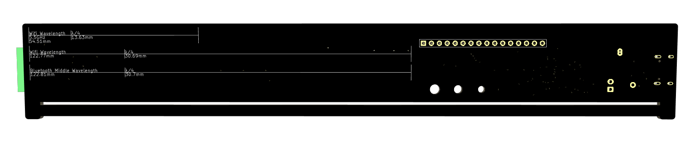

# this ruler has wifi
(And bluetooth!)

This is an RP2040 ruler that implements wifi, bluetooth, BLE along with a 4MB Flash storage, LEDs, Input buttons and some cool units and lengths!

## Feature list
- wifi
- bluetooth (BT5.2 & BLE)
- 4x RGB Addressable LEDs
- 3x Input buttons
- GPIO output header for more hacky
- Weird units
  - Space Units like Light-picosecond, 10e-18 parsecs and 10e-12 AU
  - The actual wavelength (and quarter wave!) of Bluetooth and Wifi (2.4GHz and - 5GHz)!
- Useful units
  - Inches (down to 0.02 inches!)
  - mm 
  - M2, M2.5 and M3 Diameter holes
  - Length Unit conversion chart
- 4MB QSPI Flash
- Buck-Boost Conversion
- Battery charging and reverse voltage protection.
  - No overcurrent, short circuit or overheating protection!

## Schematic 

## PCB

The production files for JLCPCB are included in `PCB/production`