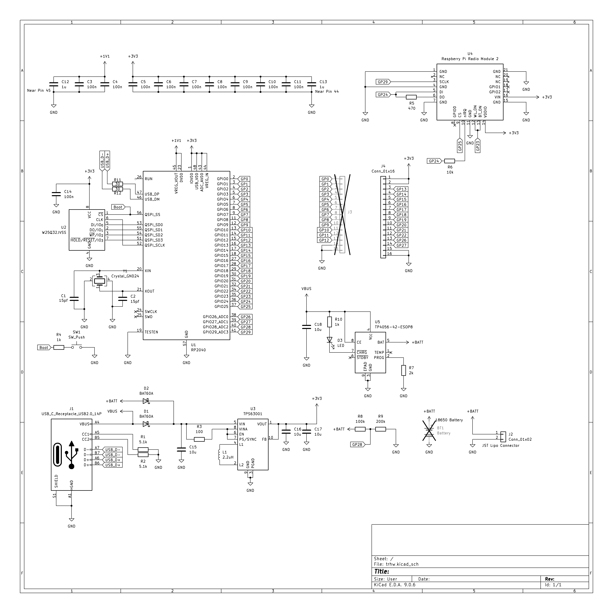
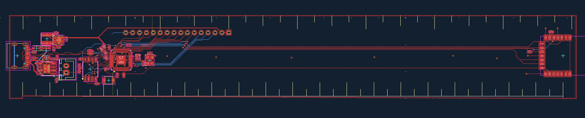

This is my log of the work I put into this project, with an estimate of how much time I spent on each step!

### Making the Schematic (3.5hr)
I started making the schematic by referring to the RP2040 Hardware design docs, as well as the docs for the Radio Module 2 and some of the other stuff I used. Most of this time was spent back and forth reading docs, picking ICs and figuring it out. I guess at one point, that's just how all PCBs work huh.

The RP2040 is pretty standard stuff, give it 3.3V, a decent QSPI flash chip and decoupling and it works like a charm. The Radio Module 2 was a bit interesting, but I just ended up following what the docs did word for word, wireless is something I really don't wanna fuck around and find out :/

The Buck/Boost is fun! I put in a TI TPS63001, which gives a nice 3v3 voltage with minimal stuff! I added 2 diodes to prevent backfeeding into USB or the battery, and installed a TP4056 in conjunction with everything else.

### Starting the PCB (2.5hr)
By this point, making this PCB was quite straightforward as well. I placed all the components and added the components. I shifted the USB C and main mcu to the left side, and the wireless stuff to the right solely because I wanted to keep both on an edge and it would look awkward and unbalanced all together. Routing is pretty easy too. The only things that needed some focus was the USB Differential pair and the QSPI length matching. I got the radio module lengths down to a 10mm difference, which isn't that good but it should be alright :p. I might fix that later though.

